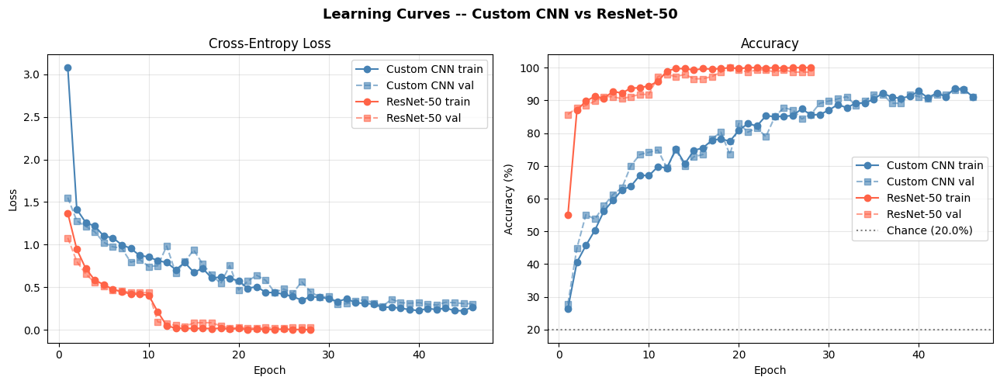
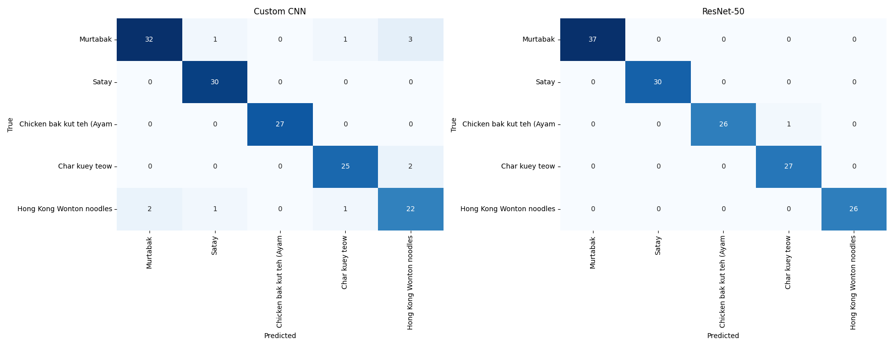
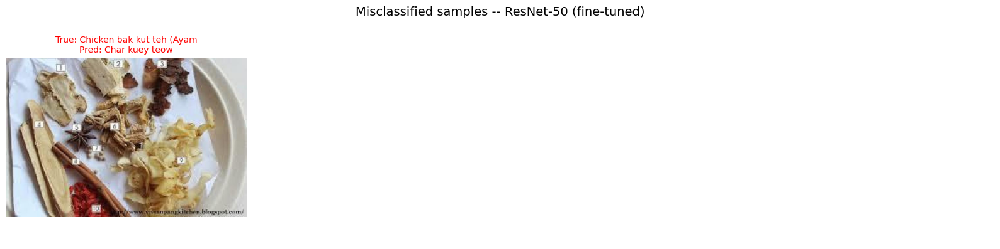
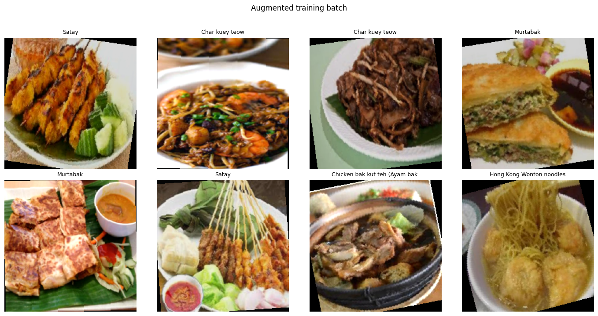

<h1 align="center">Malaysian Food Image Classifier 🍛</h1>

<p align="center">
  <strong>A Deep Learning project comparing a Custom CNN and a fine-tuned ResNet-50 for recognizing popular Malaysian cuisine.</strong>
</p>

<p align="center">
  
  
  
</p>

## Table of Contents
- [About the Project](#about-the-project)
- [Dataset](#dataset)
- [Project Structure](#project-structure)
- [Model Architectures](#model-architectures)
- [Results & Performance](#results--performance)
-[Business Applications](#business-applications)
- [Author](#author)

---

## About the Project

This repository contains an image classification pipeline designed to identify 5 popular Malaysian dishes. Developed for the WID3011 Deep Learning coursework, the project explores the performance gap between a scratch-built architecture and industry-standard transfer learning.

The study compares:
1. **Custom CNN:** A 6-layer architecture designed for fine-grained texture extraction.
2. **Transfer Learning (ResNet-50):** A pre-trained model adapted via a two-stage fine-tuning strategy.

## Dataset

The models are trained on a curated subset of the **IEEE DataPort MF-150 Multilabel Malaysian Foods Dataset** (Tahir & Loo, 2020).

* **Classes (5):** Murtabak, Satay, Chicken Bak Kut Teh, Char Kuey Teow, and Hong Kong Wonton Noodles.
* **Size:** 979 total images, utilizing a stratified 70% Training / 15% Validation / 15% Testing split.
* **Pre-processing:** Class-weighted cross-entropy loss was implemented to handle inherent dataset imbalances.

### Data Sources
- **Original Dataset:** [IEEE DataPort MF-150](https://ieee-dataport.org/open-access/mf-150-multilabel-malaysian-foods-dataset-ingredient-detection)
- **Processed Dataset:** [Project Google Drive](https://drive.google.com/drive/folders/1iKM2peSh0m8V5jHlJYXiMmRp0AwQkP9c)

*Note: The dataset uses numeric folder IDs which are mapped to human-readable names via the included `foldernames.csv`.*

## Project Structure
```text
Malaysian-Food-CNN-Classifier/
│
├── notebook/
│   └── WID3011_Individual_Assignment.ipynb   # Main pipeline (training, evaluation)
│
├── report/
│   └── Individual_Assignment_WID3011.pdf     # Technical documentation
│
├── data/
│   └── processed/
│       ├── train.csv                         # Training split (70%)
│       ├── val.csv                           # Validation split (15%)
│       ├── test.csv                          # Testing split (15%)
│       └── meta.json                         # Dataset metadata
│
├── results/                                  # Visualization exports
│   ├── learning_curves.png
│   ├── confusion_matrix_comparison.png
│   ├── misclassified_samples.png
│   └── augmented_batch.png
│
├── foldernames.csv                           # Class ID → label mapping
├── .gitignore
└── README.md
```

## Model Architectures

### 1. Custom CNN
* **Structure:** A 5-stage VGG-style network (approx. 13.28M parameters).
* **Feature Extraction:** Uses dual $3 \times 3$ convolutions in initial stages to capture complex textures, followed by max pooling and 0.5 dropout for regularization.

### 2. ResNet-50 (Transfer Learning)
* **Strategy:** Two-stage training for optimal convergence.
* **Stage 1:** Head warm-up with a frozen backbone (learning rate of $1 \times 10^{-3}$).
* **Stage 2:** Full end-to-end fine-tuning (learning rate of $1 \times 10^{-4}$).

## Results & Performance

Evaluated on an unseen testing set of 147 images, the ResNet-50 model significantly outperformed the Custom CNN in both accuracy and training efficiency.

| Metric | Custom CNN | ResNet-50 |
|--------|------------|------------|
| Total Parameters | 13,281,765 | 23,518,277 |
| Best Validation Accuracy | 93.20% | 100.00% |
| Test Accuracy | 92.52% | 99.32% |
| Training Time | 380.3s | 265.2s |
| Epochs to Converge | 46 | 28 |

### Key Observations
* **ResNet-50:** Achieved near-perfect generalization with only 1 misclassification (Chicken Bak Kut Teh mistaken for Char Kuey Teow).
* **Custom CNN:** Produced 11 misclassifications, primarily struggling with visual similarities between Hong Kong Wonton Noodles and Char Kuey Teow.

*(Note: Ensure you have pushed the image files below to your repository for them to render correctly)*

### Visualizations

**Learning Curves**  
Visualizes training and validation performance to monitor model convergence.  


**Confusion Matrix Comparison**  
Highlights class-wise prediction accuracy differences between both models.  


**Misclassified Samples**  
Examples of incorrect predictions, demonstrating the confusion between visually similar classes.  


**Data Augmentation Effects**  
Displays the data augmentation techniques applied to improve model generalization.  


## Business Applications

This classification model holds practical value for Malaysian Small and Medium Enterprises (SMEs):
* **Auto-tagging for Delivery Apps:** Helping home-based businesses automatically categorize dishes for platforms like GrabFood or Foodpanda.
* **Snap-and-Order Kiosks:** Assisting tourists in identifying unfamiliar dishes in local food courts to overcome language barriers.
* **Calorie Tracking:** Integration with the Malaysian Food Composition Database (MyFCD) to provide nutritional estimations based on image recognition.

---

## Author
[Ooi Rui Zhe](https://github.com/RextonRZ)
